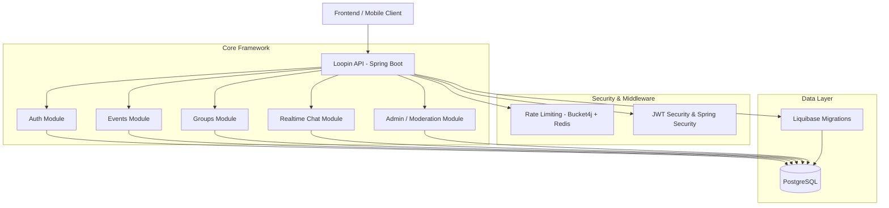

# System Architecture

The Loopin API is designed around a clean, layered architectural pattern, built on Spring Boot. It uses a database-driven domain model, version-controlled schema migrations, token-based stateless authentication, and distributed rate limiting to maintain reliability and scalability.

---

## Architectural Diagram

The diagram below outlines the system components and interactions:



---

## Code Layering Pattern

The codebase follows the industry-standard layered architecture pattern, separating concerns between controllers, business logic, persistence, and data transfer.

```
com.loopin.api
 ├── auth            # Authentication logic (Google login DTOs, controllers, services)
 ├── common          # Shared utilities, filters, and global handlers
 │    ├── enums      # Shared model enumerations
 │    ├── exception  # Exception handlers and custom API errors
 │    ├── ratelimit  # Rate limiter filter using Bucket4j and Redis
 │    └── security   # Security configuration and custom token interceptors
 ├── config          # Application configuration classes
 ├── controller      # REST Controllers (exposing HTTP endpoints)
 ├── dto             # Data Transfer Objects for requests and responses
 ├── entity          # JPA Entities mapping directly to database tables
 ├── mapper          # Entity-to-DTO and DTO-to-Entity mapping utilities
 ├── repository      # Spring Data JPA Repository interfaces
 └── service         # Business Logic Layer
      ├── abstraction  # Service interfaces definition
      └── implementation # Business logic implementation classes
```

### 1. Presentation Layer (Controllers)
Receives incoming HTTP requests, validates input payloads using Jakarta Validation annotations (`@Valid`, `@NotNull`, etc.), delegates execution to the appropriate service, and returns standardized `ResponseEntity` models.

### 2. Business Logic Layer (Services)
Contains all business rules, validation logic (such as checking if a group size exceeds limits, or if a user is authorized to perform actions), transaction boundaries, and coordinates database reads/writes. Services implement interface contracts defined in `service/abstraction`.

### 3. Data Access Layer (Repositories)
Utilizes Spring Data JPA to execute database CRUD operations. Entities are mapped to tables using standard JPA annotations (`@Entity`, `@Table`, `@Id`, etc.).

### 4. Integration Layer (DTOs & Mappers)
Ensures database entities are not leaked directly to the client. Request DTOs capture input parameters, while Response DTOs return structured data. Mappers translate between Entities and DTOs.

---

## Key Architectural Components

### Stateless Security & Token Auth
Loopin uses Spring Security configured to be entirely **stateless**. The request pipeline intercepts incoming calls via a custom JWT validation filter, decodes claims, verifies signatures against a secret key, and establishes user contexts for authorized endpoints.

###  Distributed Rate Limiting
To defend against DDoS, brute force, and api abuse, Loopin implements a rate-limiting filter using **Bucket4j** integrated with **Redis (Lettuce client)**. Depending on the path and method:
- **/auth/\*\*** endpoints are tightly capped (e.g., 10 reqs/min).
- **GET** endpoints permit a higher volume of traffic (e.g., 120 reqs/min).
- **POST/PUT/DELETE** write requests are capped at moderate volumes (e.g., 60 reqs/min).

###  Liquibase Schema Control
No automated DDL schema creation is performed at run-time (`ddl-auto: validate`). All database operations (table creation, indexing, relationships, changes) are declared as Liquibase changesets under `db/changelog/changes`. This ensures reproducible, testable, and environment-agnostic database state.