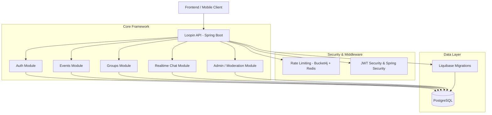

# System Architecture

The Loopin API is designed around a clean, layered architectural pattern, built on Spring Boot. It uses a database-driven domain model, version-controlled schema migrations, token-based stateless authentication, and distributed rate limiting to maintain reliability and scalability.

---

## Architectural Diagram

The diagram below outlines the system components and interactions:



---

## Package Organization

The former global technical-layer layout is retained below as historical context. The active layout is a package-based modular monolith, described after it.

```
com.loopin.api
 ├── auth            # Authentication logic (Google login DTOs, controllers, services)
 ├── common          # Shared utilities, filters, and global handlers
 │    ├── enums      # Shared model enumerations
 │    ├── exception  # Exception handlers and custom API errors
 │    ├── ratelimit  # Rate limiter filter using Bucket4j and Redis
 │    └── security   # Security configuration and custom token interceptors
 ├── config          # Application configuration classes
 ├── controller      # REST Controllers (exposing HTTP endpoints)
 ├── dto             # Data Transfer Objects for requests and responses
 ├── entity          # JPA Entities mapping directly to database tables
 ├── mapper          # Entity-to-DTO and DTO-to-Entity mapping utilities
 ├── repository      # Spring Data JPA Repository interfaces
 └── service         # Business Logic Layer
      ├── abstraction  # Service interfaces definition
      └── implementation # Business logic implementation classes
```

### Active Modular Monolith Layout

```
com.loopin.api
|- events             # event controller, commands, queries, repository, entity, dto, mapper, job, seed
|- groups             # group aggregate, controller, service, repository, entity, dto, mapper, job, seed
|- users              # controller, service, repository, entity, dto, mapper, seed
|- interests          # controller, service, repository, entity, dto, mapper
|- auth               # authentication controller, DTOs, role model, services
|- chat               # REST/STOMP controllers, message persistence, DTOs, services
|- reports            # report endpoints, persistence, mapping, and services
|- moderation         # moderation/admin endpoints, policies, persistence, services
|- notifications      # notification endpoints, delivery services, repositories, jobs
|- recommendation     # event and user embedding workflows
|- ai                 # client, configuration properties, request/response DTOs
`- common
   |- config          # application, security, cache, async, and WebSocket configuration
   |- exception       # global error handling and shared error DTOs
   |- security        # JWT and WebSocket security infrastructure
   |- ratelimit       # Bucket4j and Redis rate-limiting infrastructure
   |- entity          # shared JPA base entity
   `- seed            # cross-module development-data orchestration
```

Each business module owns its layer-specific types, preserving the current service behavior while removing the global `controller`, `service`, `repository`, `entity`, `dto`, and `mapper` packages.

### Group Aggregate Ownership

`EventGroup` is owned by the Groups module and is located at
`com.loopin.api.groups.entity.EventGroup`, with persistence access at
`com.loopin.api.groups.repository.EventGroupRepository`. Its `event_id` relationship remains
an association to the Events module's `Event` entity; the physical `event_groups` table and all
existing columns and foreign keys are unchanged. Events, Chat, Notifications, Moderation, and
other modules reference the Groups-owned aggregate rather than defining their own group
persistence types.

### Module Application APIs

Repositories are internal implementation details of their owning module. Cross-module business
orchestration uses small application APIs instead of foreign repositories:

- `users.api.UserLookup` supplies required user lookups.
- `events.api.EventLookup` supplies active-event lookup for Groups.
- `groups.api.GroupLifecycle` and `GroupMemberLookup` expose event-related group lifecycle and
  membership reads to Events.
- `notifications.api.NotificationWriter` is the write boundary for notifications.
- `recommendation.api.RecommendationIndexer` is the event-indexing boundary.

Allowed dependencies follow the direction of these APIs: Events may depend on Groups,
Notifications, Recommendation, and Users through their `api` packages; Groups may depend on
Events and Users through their `api` packages. Modules must not import another business module's
`repository` package in application handlers. Shared persistence entities may be used only where
the relationship itself requires it; no HTTP or separate service boundary is introduced.

### Events Incremental Vertical Slices And Lightweight CQRS

The Events module will move incrementally from its current service-oriented implementation to vertical slices. This is a package and naming convention, not a command bus, mediator, event-sourcing, or separate read/write database design. Existing REST paths, PostgreSQL storage, JPA entities, and repositories stay in place while each use case is migrated.

New Events work belongs to a use-case package rather than a shared technical layer. The target shape is:

```
com.loopin.api.events
|- api                         # existing REST adapter: controller and HTTP DTOs
|- create
|  |- CreateEventCommand.java
|  `- CreateEventHandler.java
|- update
|  |- UpdateEventCommand.java
|  `- UpdateEventHandler.java
|- cancel
|  |- CancelEventCommand.java
|  `- CancelEventHandler.java
|- moderation
|  |- ApproveEventModerationCommand.java
|  |- ApproveEventModerationHandler.java
|  |- RejectEventModerationCommand.java
|  `- RejectEventModerationHandler.java
|- getpublished
|  |- GetPublishedEventsQuery.java
|  `- GetPublishedEventsHandler.java
|- getpublishedbyid
|  |- GetPublishedEventByIdQuery.java
|  `- GetPublishedEventByIdHandler.java
|- shared
|  |- finder                  # reusable event and current-user lookups
|  |- interest                # event-interest replacement and identifier resolution
|  |- moderation              # moderation decision application to event visibility
|  |- policy                  # reusable event rules, such as lifecycle decisions
|  `- validation              # reusable domain validation, including EventValidator
|- entity                      # existing JPA entities during migration
|- repository                  # existing Spring Data JPA repositories during migration
`- mapper                      # existing persistence/response mapping during migration
```

Package names are lowercase use-case names; types use an imperative action plus `Command` or `Query`, with the corresponding `Handler`. A command changes state and a query does not. Controllers remain thin HTTP adapters: they validate the HTTP request, construct one command or query, and translate its result to the existing response contract. A handler may call the existing repositories, mappers, notifications, and integrations directly while that slice is being extracted; no mediator is introduced.

Policies are business rules shared by multiple slices, not general-purpose utility classes. For example, `events.shared.policy.EventLifecyclePolicy` owns the backend's initial status and moderation lifecycle decisions. Validators that only apply to one use case stay with that slice; reusable validation belongs in `events.shared.validation`. Jakarta request validation remains at the API boundary, while handlers enforce authorization, lifecycle, and persistence invariants.

Each command handler owns one transaction boundary (`@Transactional`). Query handlers are `@Transactional(readOnly = true)` when they require a persistence context. Database writes, lifecycle changes, and required local side effects are completed in the command transaction; external or retryable work should be requested after commit rather than extending that transaction. This keeps the current PostgreSQL/JPA model intact and makes each future extraction independently testable.

Normal event create and update requests never contain `status`. The backend assigns the initial status (`PUBLISHED` for automatically approved content); content requiring moderation is moved to `DRAFT`. Lifecycle changes are separate commands: `CancelEventCommand`, `ApproveEventModerationCommand`, and `RejectEventModerationCommand`. The existing moderation approval/rejection endpoints already represent the latter two operations; no endpoint paths are changed in this preparation phase.

**Event Lifecycle Transitions:**
```
DRAFT      -> PUBLISHED (moderation approval / auto-approve)
DRAFT      -> CANCELLED (cancel command)
PUBLISHED  -> DRAFT     (moderation rejection on update)
PUBLISHED  -> CANCELLED (cancel command)
PUBLISHED  -> COMPLETED (completion job)
CANCELLED  -> (terminal)
COMPLETED  -> (terminal)
```

### Vertical Slices And Lightweight CQRS

Events and Groups use vertical slices for business operations that have distinct authorization,
lifecycle, persistence, or performance concerns. This is **lightweight CQRS**: commands and
queries have separate handler classes, but share the same Spring application, PostgreSQL database,
JPA model, and REST endpoints. There is no command bus, mediator, event sourcing, read database,
or microservice boundary.

- A **command** changes state. It is named `VerbNounCommand` and handled by
  `VerbNounHandler`; the handler owns the write `@Transactional` boundary.
- A **query** returns data. It is named `Get/List...Query` and handled by a matching handler;
  it uses `@Transactional(readOnly = true)` when a persistence context is needed.
- Controllers are HTTP adapters only: validate input, construct one command/query, call one
  handler, and preserve the existing endpoint/response contract.
- Shared policies own reusable rules such as event lifecycle, group administration, group
  membership, and capacity. Do not reimplement those checks in individual handlers.

Current package examples:

```text
com.loopin.api.events
|- create/CreateEventCommand + CreateEventHandler
|- listpublishedevents/ListPublishedEventsQuery + ListPublishedEventsHandler
|- update, cancel, delete
`- shared/{access, finder, interest, moderation, notification, policy, validation}

com.loopin.api.groups
|- creategroup, updategroup, changegroupstatus
|- addgroupmember, removegroupmember
|- creategroupjoinrequest, approvegroupjoinrequest, rejectgroupjoinrequest
|- getgroupdetails, listgroupmembers, getmembershipdetails
`- shared/{finder, joinrequest, policy}
```

#### Creating A New Use Case

1. Keep the existing controller route and DTO when the HTTP contract already exists.
2. Create a lowercase use-case package with an explicit command/query record and handler.
3. Put authorization, validation, and transaction ownership in the handler; reuse an existing
   shared policy before creating a new one.
4. Keep repositories inside their owning module. For cross-module behavior, depend on a narrow
   application API (for example `UserLookup`, `GroupLifecycle`, `NotificationWriter`, or
   `RecommendationIndexer`) rather than a foreign repository.
5. Add a handler unit test and route/integration coverage. Commands should test their state and
   local side effects; queries should test authorization, ordering, and response shape.

#### When A Traditional Service Is Acceptable

A small service remains appropriate when it is module-local, has cohesive shared behavior, and
does not blend unrelated commands and queries—for example a delivery processor, scheduled-job
helper, mapper support, or a simple CRUD module without meaningful business branches. Do not add
a handler merely to wrap one repository call when it makes the code less clear. Conversely, split
a broad service once it combines independent reads, writes, authorization, lifecycle transitions,
or external side effects.

### 1. Presentation Layer (Controllers)
Receives incoming HTTP requests, validates input payloads using Jakarta Validation annotations (`@Valid`, `@NotNull`, etc.), delegates execution to the appropriate service, and returns standardized `ResponseEntity` models.

### 2. Business Logic Layer (Services)
Contains all business rules, validation logic (such as checking if a group size exceeds limits, or if a user is authorized to perform actions), transaction boundaries, and coordinates database reads/writes. Service contracts and implementations live together under their owning module's `service` package.

### 3. Data Access Layer (Repositories)
Utilizes Spring Data JPA to execute database CRUD operations. Entities are mapped to tables using standard JPA annotations (`@Entity`, `@Table`, `@Id`, etc.).

### 4. Integration Layer (DTOs & Mappers)
Ensures database entities are not leaked directly to the client. Request DTOs capture input parameters, while Response DTOs return structured data. Mappers translate between Entities and DTOs.

---

## Key Architectural Components

### Stateless Security & Token Auth
Loopin uses Spring Security configured to be entirely **stateless**. The request pipeline intercepts incoming calls via a custom JWT validation filter, decodes claims, verifies signatures against a secret key, and establishes user contexts for authorized endpoints.

###  Distributed Rate Limiting
To defend against DDoS, brute force, and api abuse, Loopin implements a rate-limiting filter using **Bucket4j** integrated with **Redis (Lettuce client)**. Depending on the path and method:
- **/auth/\*\*** endpoints are tightly capped (e.g., 10 reqs/min).
- **GET** endpoints permit a higher volume of traffic (e.g., 120 reqs/min).
- **POST/PUT/DELETE** write requests are capped at moderate volumes (e.g., 60 reqs/min).

###  Liquibase Schema Control
No automated DDL schema creation is performed at run-time (`ddl-auto: validate`). All database operations (table creation, indexing, relationships, changes) are declared as Liquibase changesets under `db/changelog/changes`. This ensures reproducible, testable, and environment-agnostic database state.
