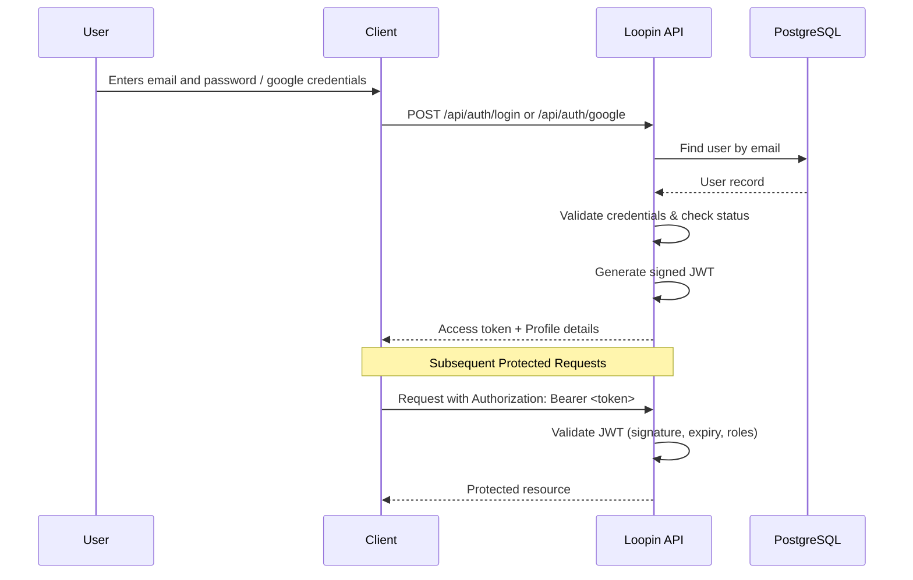

# Authentication & Authorization Flow

Loopin uses stateless token-based authentication. Users authenticate once and receive a JSON Web Token (JWT) in response. This token must be included in the `Authorization` header of subsequent requests to access protected resources.

---

## 🔄 Authentication Sequence Diagram

The diagram below illustrates the flow of authentication and resource access:

---

## 🔑 Authentication Mechanisms

Loopin supports two methods of authentication:

### 1. Local Email / Password Registration & Authentication
* **Registration:** Users submit registration details via `POST /api/users/register`. The password is encrypted using a cryptographic hashing algorithm (BCrypt) before storing it in the database.
* **Authentication:** Users provide credentials to obtain a token. The backend verifies credentials against the stored hashes and returns a valid JWT.

### 2. Google Social Login
* **Mechanism:** The client obtains an OAuth2 ID token from Google on the frontend and passes it to `POST /api/auth/google`.
* **Backend Processing:**
  1. The API validates the token integrity against Google's public key endpoints.
  2. The system checks if a user with that Google ID or email already exists.
  3. If they exist, the system logs them in. If not, it registers them as a new user.
  4. A local JWT is generated and returned to the client.

---

## 🛡️ JWT Request Interception Lifecycle

For every HTTP request targeting a protected route, the request passes through the Spring Security Filter Chain:

1. **Extraction:** A custom security filter (`JwtAuthenticationFilter`) reads the `Authorization` header of the HTTP request.
2. **Parsing:** It extracts the token, stripping the `Bearer ` prefix.
3. **Validation:**
   * Checks the token signature against the configured `jwt.secret`.
   * Checks the expiration claim (`exp`) to ensure the token is still valid.
   * Extracts user details, claims, and roles (e.g., `ROLE_USER`, `ROLE_ADMIN`).
4. **Context Injection:** If valid, the filter creates an `Authentication` object and injects it into the Spring Security Context (`SecurityContextHolder`).
5. **Access Resolution:** The request continues to the controllers. Methods annotated with `@PreAuthorize("hasRole('...')")` check the user's role before executing.
6. **Failure Handling:** If the token is missing, expired, or malformed, the `CustomAuthEntryPoint` immediately returns a `401 Unauthorized` response with a JSON payload.