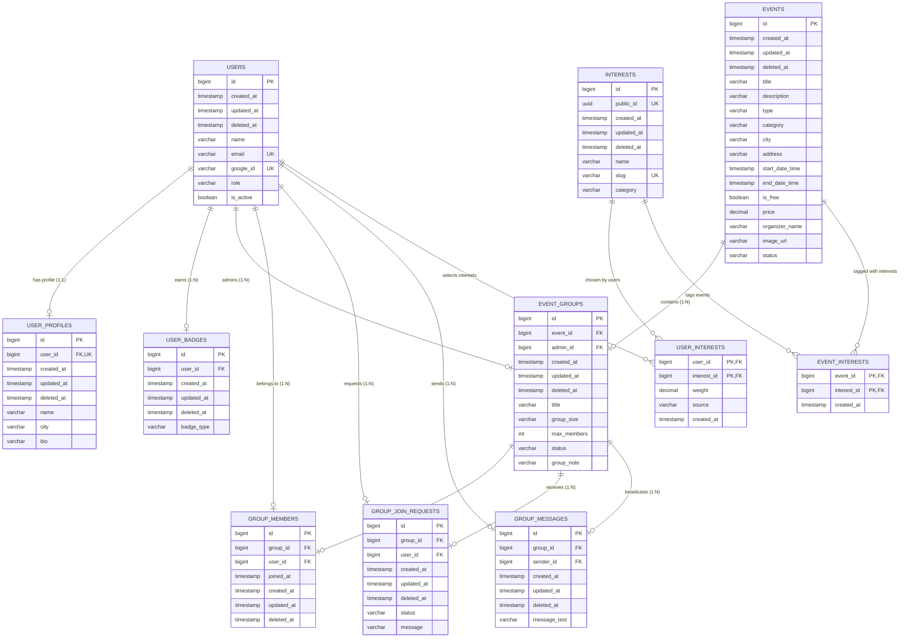

# Database Design & Schema Reference

Loopin uses PostgreSQL as its primary transactional database. Schema migrations are managed and version-controlled via **Liquibase**.

---

##  Entity Relationship (ER) Diagram

The diagram below outlines the core tables and their relationships:

---

##  Detailed Table Descriptions

### 1. `users`
Stores user authentication records, credentials reference, and roles.
* `id` (BIGINT, Primary Key): Auto-incremented unique user identifier.
* `email` (VARCHAR, Unique, Not Null): User's registration email. Used as the principal for authentication.
* `google_id` (VARCHAR, Unique, Nullable): Google User ID returned by Google Identity OAuth.
* `name` (VARCHAR, Not Null): Display name of the user.
* `role` (VARCHAR, Not Null): Application role (e.g. `USER`, `ADMIN`).
* `is_active` (BOOLEAN, Not Null): Flag representing whether the account is active or suspended.
* `created_at` / `updated_at` / `deleted_at`: Audit timestamps (supports soft deletion).

### 2. `events`
Details events discovered and linked by coordinates.
* `id` (BIGINT, Primary Key): Auto-incremented event ID.
* `title` (VARCHAR(120), Not Null): The title of the event.
* `description` (VARCHAR(2000), Not Null): Narrative description of the event.
* `type` (VARCHAR(30), Not Null): Event format (e.g., `EVENT`, `ACTIVITY`).
* `category` (VARCHAR(30), Not Null): Theme (e.g., `TECH`, `STARTUP`, `SOCIAL`).
* `city` (VARCHAR(100), Not Null): Target city for location filters.
* `address` (VARCHAR(255)): Street address (physical location).
* `start_date_time` / `end_date_time` (TIMESTAMP, Not Null): Schedule constraints.
* `is_free` (BOOLEAN, Not Null): Ticket price availability flag.
* `price` (DECIMAL(10,2)): Numeric price context if not free.
* `organizer_name` (VARCHAR(120), Not Null): Primary event owner/organization name.
* `image_url` (VARCHAR(500)): Banner/cover photo url.
* `status` (VARCHAR(30), Not Null): Lifecycle status (e.g. `DRAFT`, `PUBLISHED`, `CANCELLED`).
* `moderation_status` (VARCHAR(30), Not Null): Moderation outcome (`APPROVED`, `PENDING_REVIEW`, or `REJECTED`).
* `moderation_rejection_reason` (VARCHAR(1000)): Optional reason recorded when the event is rejected.

### 3. `user_profiles`
Associated with `users` via a 1-to-1 mapping. Contains optional details.
* `user_id` (BIGINT, Unique, Foreign Key -> `users.id`): Back-reference.
* `name` (VARCHAR): Profile-specific display name.
* `city` (VARCHAR): User's home city.
* `bio` (VARCHAR): Mini bio/description.

### 4. `event_groups`
Represents group bubbles created to attend events together.
* `event_id` (BIGINT, Foreign Key -> `events.id`): The event this group is coordinating for.
* `admin_id` (BIGINT, Foreign Key -> `users.id`): The creator/administrator of this group.
* `title` (VARCHAR): Group title.
* `group_size` (VARCHAR): General classification size text.
* `max_members` (INT, Not Null): Capacity ceiling constraint.
* `status` (VARCHAR): Status of group (e.g. `OPEN`, `FULL`, `ARCHIVED`, `CANCELLED`).
* `group_note` (VARCHAR): Notes/rules set by the admin.

### 5. `group_members`
A join table representing members of an approved group.
* `group_id` (BIGINT, Foreign Key -> `event_groups.id`): Reference to group.
* `user_id` (BIGINT, Foreign Key -> `users.id`): Reference to user.
* `joined_at` (TIMESTAMP): Time when join request was approved.

### 6. `group_join_requests`
Requests sent by users to join an event group.
* `group_id` (BIGINT, Foreign Key -> `event_groups.id`): Reference to target group.
* `user_id` (BIGINT, Foreign Key -> `users.id`): Requesting user.
* `status` (VARCHAR): State of request (e.g. `PENDING`, `APPROVED`, `REJECTED`).
* `message` (VARCHAR(500)): Personal pitch/message to the group admin.

### 7. `group_messages`
Persists the chat history for each event group.
* `group_id` (BIGINT, Foreign Key -> `event_groups.id`): Target channel.
* `sender_id` (BIGINT, Foreign Key -> `users.id`): Message author.
* `message_text` (VARCHAR(255), Not Null): Content payload.

### 8. `user_badges`
Badges awarded to users (e.g. "Frequent Organizer", "Early Adopter").
* `user_id` (BIGINT, Foreign Key -> `users.id`): Reference to recipient.
* `badge_type` (VARCHAR): Badge classification.

### 9. `interests`
Normalized interest catalog used for profile preferences, event tagging, recommendations, and future matching.
* `id` (BIGINT, Primary Key): Internal interest identifier.
* `public_id` (UUID, Unique, Not Null): Public API identifier.
* `name` (VARCHAR(120), Not Null): Display label.
* `slug` (VARCHAR(140), Unique, Not Null): Stable normalized key. Duplicate interests are prevented by `uk_interests_slug`.
* `category` (VARCHAR(80)): Optional grouping label.
* `created_at` / `updated_at` / `deleted_at`: Audit timestamps.

### 10. `user_interests`
Join table connecting users to selected interests.
* `user_id` (BIGINT, Primary Key, Foreign Key -> `users.id`): User reference.
* `interest_id` (BIGINT, Primary Key, Foreign Key -> `interests.id`): Interest reference.
* `weight` (DECIMAL(5,2), Not Null): Preference strength, defaulting to `1.00`.
* `source` (VARCHAR(50), Not Null): Origin of the preference, defaulting to `USER`.
* `created_at` (TIMESTAMP, Not Null): Assignment timestamp.

### 11. `event_interests`
Join table tagging events with relevant interests.
* `event_id` (BIGINT, Primary Key, Foreign Key -> `events.id`): Event reference.
* `interest_id` (BIGINT, Primary Key, Foreign Key -> `interests.id`): Interest reference.
* `created_at` (TIMESTAMP, Not Null): Assignment timestamp.

---

##  Migration & Auditing Strategy

1. **Soft Delete:** Entities do not get purged immediately. Deletions set `deleted_at`, which is filtered at the JPA repository level using custom SQL filters or Hibernate annotations (`@SQLRestriction`).
2. **Version Control:** Schema upgrades are authored inside `src/main/resources/db/changelog/changes` using YAML structure. Modifications to existing tables must be appended as new changesets rather than modifying existing ones.
3. **Liquibase Locks:** During deployments, Liquibase locks the table `DATABASECHANGELOGLOCK` to ensure parallel instances do not attempt simultaneous schema updates.
