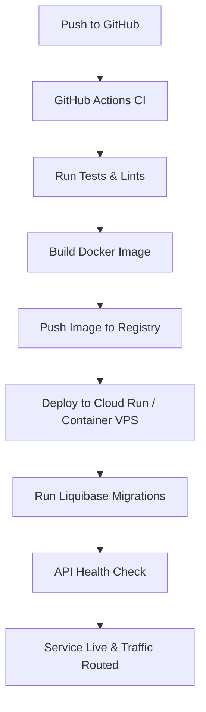

# Deployment Guide

The Loopin API is designed to run in containerized environments. This guide explains how to package, deploy, and verify the application in staging and production environments.

---

##  Deployment Pipeline Diagram

The diagram below details the continuous integration and deployment pipeline:



---

## Docker Containerization

The Loopin API uses a multi-stage Docker build to keep images small and secure.

### Multi-Stage Dockerfile (Recommended)
```dockerfile
# Stage 1: Build
FROM maven:3.9-eclipse-temurin-21 AS build
WORKDIR /app
COPY pom.xml .
RUN mvn dependency:go-offline
COPY src ./src
RUN mvn clean package -DskipTests

# Stage 2: Runtime
FROM eclipse-temurin:21-jre-alpine
WORKDIR /app
COPY --from=build /app/target/loopin-api-*.jar app.jar
EXPOSE 8080
ENTRYPOINT ["java", "-Dspring.profiles.active=production", "-jar", "app.jar"]
```

### Build & Run Locally with Docker
1. **Build image:**
   ```bash
   docker build -t loopin-api:latest .
   ```
2. **Start system using Docker Compose:**
   ```bash
   docker-compose up -d
   ```
   *This spins up PostgreSQL, Redis, and the API container.*

---

##  Deploying to Cloud Providers

### 1. Google Cloud Run (Recommended serverless deployment)
Google Cloud Run is well-suited for containerized Spring Boot applications:
1. Build the container using Google Cloud Build:
   ```bash
   gcloud builds submit --tag gcr.io/your-project-id/loopin-api
   ```
2. Deploy to Cloud Run:
   ```bash
   gcloud run deploy loopin-api \
       --image gcr.io/your-project-id/loopin-api \
       --platform managed \
       --region us-central1 \
       --allow-unauthenticated \
       --set-env-vars DATABASE_URL="jdbc:postgresql://<db-ip>:5432/loopin",JWT_SECRET="<secret>"
   ```

### 2. Standard Virtual Private Server (VPS)
For traditional deployments (AWS EC2, DigitalOcean Droplet, Linode):
1. Install Docker and Docker Compose on the host.
2. Transfer your code and `.env` file to the server.
3. Launch container stacks:
   ```bash
   docker compose -f docker-compose.prod.yml up -d
   ```

---

## Database Migrations during Deployment
* **Startup Auto-Migration:** By default, `spring.liquibase.enabled=true` ensures migrations execute on application boot, applying schema updates.
* **Pre-deployment Migration:** In high-availability setups where multiple API instances start simultaneously, migrations can be run as a separate pipeline task prior to routing traffic to new container versions:
  ```bash
  mvn liquibase:update -Dliquibase.url="jdbc:postgresql://<db-ip>:5432/loopin" ...
  ```

---

## Post-Deployment Verification
Verify application health via the health endpoint:
```bash
curl -f http://<app-domain>/api/actuator/health
```
A successful response should return `{"status":"UP"}`.
