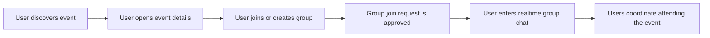

# Product Logic & User Flow

Loopin connects users through local events and coordinated group coordination. This document details the product logic, from event discovery to real-time chat coordination.

---

##  User Flow Diagram

The diagram below maps the primary lifecycle of user interaction:

---

##  Core Business Rules

### 1. Events Discovery & Types
* **Categories:** Events are cataloged by type (e.g., `TECH`, `MUSIC`, `SPORTS`, `ART`, `FOOD`, etc.).
* **Free vs. Paid:** Events can be free or paid. Paid events require explicit price parameters.
* **Status:** Events can be `DRAFT`, `PUBLISHED`, or `CANCELLED`. Only `PUBLISHED` events are discoverable by regular users.

### 2. Event Groups & Coordination
* When a user wants to attend an event with others, they can either:
  1. **Create a Group:** The user becomes the group *admin/moderator*. They define group details (title, maximum size, rules, introductory note).
  2. **Join an Existing Group:** The user submits a request to join an active group associated with that event.
* **Group Constraints:**
  * Groups cannot exceed their defined `max_members`.
  * Users can only view and participate in chats of groups where their membership status is `APPROVED`.

### 3. Join Request Approval Flow
To maintain a safe environment, joining a group is not always automatic:
1. **Request Submission:** The user submits a join request with an optional introductory message.
2. **Review:** The group's admin reviews requests via `/groups/{groupId}/join-requests`.
3. **Outcome:**
   * **Approve:** The user's status shifts to `APPROVED`, they are added to the group member list, and they gain access to the WebSocket chat room.
   * **Reject/Delete:** The request is rejected or cancelled.

---

##  Moderation & Content Checking

To ensure community safety, Loopin enforces content filters:
* **Banned Words Filter:** When creating events or sending chat messages, content is checked against a configurable moderation list (`moderation.banned-words`).
* **Role Hierarchies:**
  * **Regular User:** Can create events, create groups, apply to join groups, and chat.
  * **Group Admin:** Moderate their own groups (approve/reject users, update group settings).
  * **System Admin (ADMIN):** Possess global moderation controls. They can update user roles, delete users, flag events, and access dashboard metrics.