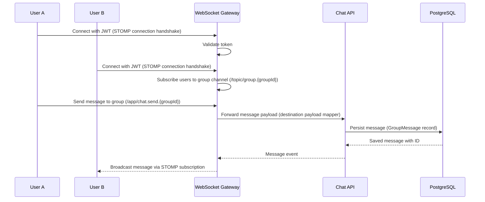

# Real-Time Group Chat Architecture

To coordinate event attendance, approved event group members communicate using a real-time messaging protocol. Loopin establishes a WebSocket connection secured via JWTs to facilitate instantaneous broadcasting.

---

##  Real-Time Chat Sequence

The diagram below details the end-to-end messaging flow:



---

##  WebSocket Protocol Details

### 1. Connection & Handshake
* **Endpoint:** WebSocket requests target `/ws` (or `/chat`).
* **Authentication:** Since standard WebSocket handshakes do not natively support customized authentication headers, the token is passed either:
  1. As a query parameter in the handshake URL: `/ws?token=<token>`
  2. Inside the connection headers of the **STOMP** framework (e.g., `passcode` or custom `Authorization` field).
* **Handshake Interceptor:** The backend extracts the token during the websocket handshake, validates it, and assigns the user identity to the connection session.

### 2. Messaging Protocol
* **Subscribing to Group Chat:**
  Clients subscribe to their group's broadcast channel:
  ```
  /topic/group.{groupId}
  ```
  Only users validated as active members of the `event_groups` (`group_members` table) are permitted to subscribe. Any unauthorized subscription requests are rejected by a subscription interceptor.
* **Sending Messages:**
  Clients dispatch messages to the destination path:
  ```
  /app/chat.send.{groupId}
  ```
  The payload contains the message body. The server stamps the message with the sender's identifier, persists it to the database, and publishes the event.

---

##  Scalability & Redis Pub/Sub

When scaling the Loopin API horizontally across multiple nodes/containers:
1. **The Problem:** A client connected to Server A will not receive a message sent by a client connected to Server B, because they hold separate in-memory WebSocket sessions.
2. **The Solution:** A distributed message broker like **Redis Pub/Sub** is introduced.
   - When Server B receives a message, it writes to the database and publishes it to a Redis topic.
   - All server nodes subscribe to the Redis topic.
   - When Server A receives the Redis subscription notification, it forwards the message to all local WebSocket sessions subscribed to `/topic/group.{groupId}`.
