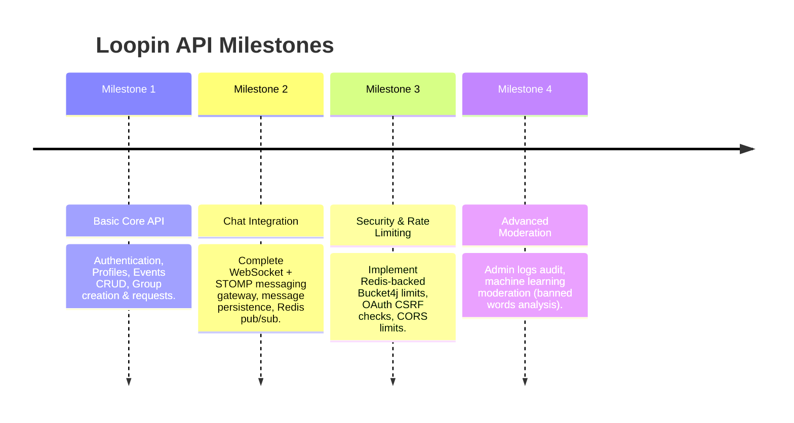

# Product Roadmap

This document outlines the planned development milestones and features for the Loopin API.

---

##  Release Roadmap & Milestones

---

##  Detailed Milestone Breakdowns

### Milestone 1: Core API Polish (Current Phase)
* **Goal:** Establish a robust REST API baseline.
* **Deliverables:**
  - Complete user authentication and registration lifecycle.
  - Implement full event creation, filtering, and discovery REST routes.
  - Implement group creation and join request approval mechanisms.
  - Seed initial database migration scripts with Liquibase.

### Milestone 2: Real-Time Chat & Communications
* **Goal:** Enable live messaging between approved event group members.
* **Deliverables:**
  - Add `spring-boot-starter-websocket` dependencies.
  - Implement STOMP messaging handler with JWT subscription checks.
  - Integrate message persistence using the `GroupMessage` schema structure.
  - Build a mock client UI to verify live chat broadcasts.
  - Configure Redis Pub/Sub as the message broker for multi-node deployments.

### Milestone 3: Resilience & Enterprise Security
* **Goal:** Harden the backend against production loads and security threats.
* **Deliverables:**
  - Switch rate-limiting storage from in-memory (`local`) to distributed (`redis`).
  - Configure automated IP address lookup resolving behind proxy headers (e.g. Cloudflare / Nginx).
  - Implement OAuth state parameter validation to protect against Cross-Site Request Forgery (CSRF).
  - Integrate automated unit and integration tests using Testcontainers and H2/PostgreSQL.

### Milestone 4: Global Administration & Advanced Moderation
* **Goal:** Give administrators tools to manage the community.
* **Deliverables:**
  - Complete the dashboard metrics controller.
  - Introduce moderation action logs (`moderation_logs` table) to track admin decisions.
  - Integrate an automated content scanning service (e.g. Perspective API or custom NLP filters) for event descriptions and chat text.
  - Implement soft-delete purge scheduling for old records.
