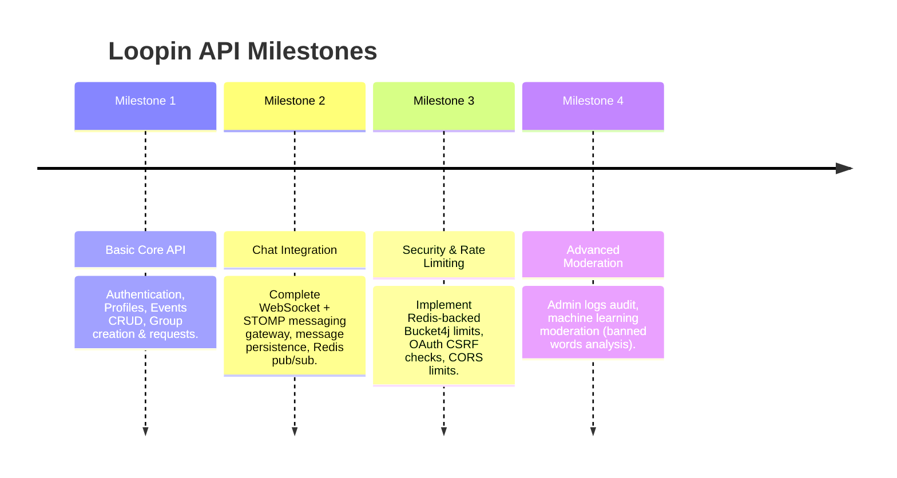

# Product Roadmap

This document outlines the planned development milestones and features for the Loopin API.

---

##  Release Roadmap & Milestones

---

##  Detailed Milestone Breakdowns

### Milestone 1: Core API Polish (Delivered)
* **Status:** Complete.
* **Deliverables:**
  - [x] Complete user authentication and registration lifecycle.
  - [x] Implement full event creation, filtering, and discovery REST routes.
  - [x] Implement group creation and join request approval mechanisms.
  - [x] Seed initial database migration scripts with Liquibase.

### Milestone 2: Real-Time Chat & Communications (Delivered)
* **Status:** Complete.
* **Deliverables:**
  - [x] Add `spring-boot-starter-websocket` dependencies.
  - [x] Implement STOMP messaging handler with JWT subscription checks.
  - [x] Integrate message persistence using the `GroupMessage` schema structure.
  - [x] Build a mock client UI to verify live chat broadcasts.
  - [x] Configure Redis Pub/Sub as the message broker for multi-node deployments.

### Milestone 3: Resilience & Enterprise Security (Delivered)
* **Status:** Complete.
* **Deliverables:**
  - [x] Switch rate-limiting storage from in-memory (`local`) to distributed (`redis`).
  - [x] Configure automated IP address lookup resolving behind proxy headers (e.g. Cloudflare / Nginx).
  - [x] Implement OAuth state parameter validation to protect against Cross-Site Request Forgery (CSRF).
  - [x] Integrate automated unit and integration tests using Testcontainers and H2/PostgreSQL.

### Milestone 4: Global Administration & Advanced Moderation (Delivered)
* **Status:** Complete.
* **Deliverables:**
  - [x] Complete the dashboard metrics controller.
  - [x] Introduce moderation action logs (`moderation_logs` table) to track admin decisions.
  - [x] Integrate an automated content scanning service (e.g. Loopin AI, NLP filters, banned words check) for event descriptions and chat text.
  - [x] Implement soft-delete purge scheduling for old records (retention policies).
