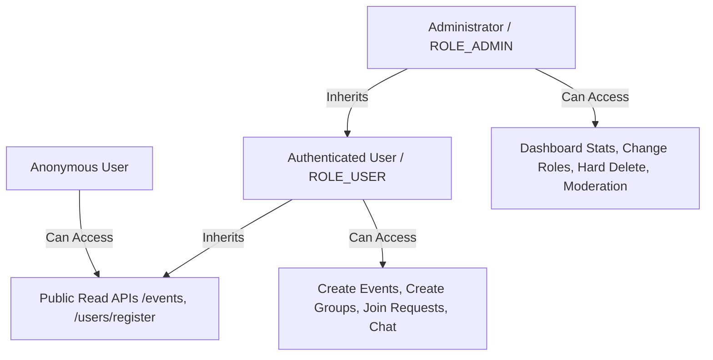

# Security Model

Security is a core design focus of the Loopin API. This document details the defensive security configurations, threat prevention, and roles setup.

---

##  1. Stateless Authentication & Session Management

Loopin API is designed around a stateless execution model. It does not use HTTP Session state (`HttpSession`).

* **Auth Pipeline:** Incoming HTTP requests targeting protected endpoints are intercepted by `JwtAuthenticationFilter`.
* **JWT Signature:** Tokens are signed using the **HS256** (HMAC with SHA-256) signature algorithm.
* **Secret Configuration:** The secret signature key is loaded via `jwt.secret` (injected via host environment). In production, this key must be a minimum of 256 bits (32 bytes) of cryptographically random text.
* **Token Payload:** Contains the user ID, email principal, role authority, and timestamp constraints (issued-at, expiration).

---

##  2. Role-Based Access Control (RBAC)

Loopin implements Spring Security annotation-driven authorization controls. Roles are prefixed with `ROLE_` during context creation.



### Authorization Enforcement Example
```java
@RestController
@RequestMapping("/admin")
@PreAuthorize("hasRole('ADMIN')")
public class AdminController {
    // Only users possessing ROLE_ADMIN are permitted execution
}
```

---

## ️ 3. Input Validation & Injection Prevention

### 1. Request Data Validation
All request payloads (DTOs) are validated at the presentation layer using **Jakarta Validation** constraints:
* `@NotBlank`: Prevents empty or whitespace-only inputs.
* `@Size(max = ...)`: Defends against buffer overflow and memory exhaustion attacks.
* `@Email`: Enforces syntactic validity of email addresses.
* `@NotNull`: Guarantees required field values are supplied.

### 2. SQL Injection Prevention
* **ORM Usage:** The database is accessed strictly via **Spring Data JPA** interfaces.
* **Parameterized Queries:** Queries are executed using JPQL or Criteria API parameterized arguments. Direct SQL string concatenation is strictly banned.

---

##  4. Cross-Origin Resource Sharing (CORS)

CORS policies restrict access to browsers accessing resources from foreign host origins.
* **Configuration Variable:** `CORS_ALLOWED_ORIGINS` (mapped from `cors.allowed-origins`).
* **Defaults:** Default values fallback to wildcards (`*`) strictly for development convenience.
* **Production Configuration:** Allowed origins must specify explicit trusted domains:
  ```yaml
  cors:
    allowed-origins: https://loopin.app,https://admin.loopin.app
  ```

---

##  5. Rate Limiting Policies

Loopin integrates the **Bucket4j** library with **Redis** to prevent denial of service (DoS) and brute force attacks.

* **Storage Configuration:** `rate-limit.storage` supports:
  - `local`: In-memory thread-safe maps (single node deployment).
  - `redis`: Lettuce-backed cluster token bucket persistence (production horizontal scale).
* **Policy Settings:**
  - **Auth Policy (`/auth/**` & `/users/register`):** 10 requests per minute per IP address.
  - **Public Read Policy (`GET` for `/events/**`, `/groups/**`):** 120 requests per minute per IP address.
  - **Authenticated Write Policy (`POST`, `PUT`, `DELETE`):** 60 requests per minute per user ID (or client IP).

---

##  6. Content Moderation Filter

A moderation controller filter checks create/update payloads against a list of banned words (`moderation.banned-words`):
* If a post contains flagged text, the server rejects the write with a `400 Bad Request` validation response.
* Banned word checks are executed at the service layer prior to database persistence.
